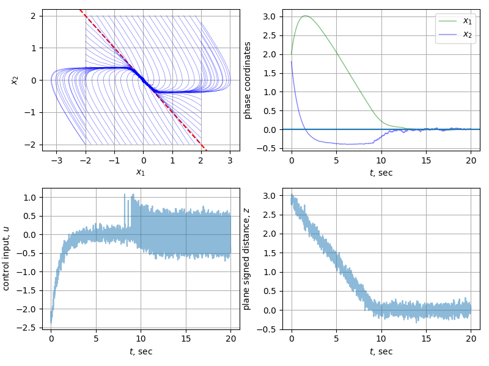
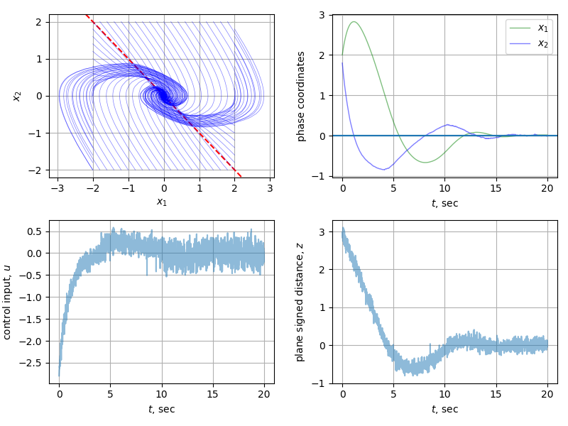

# Sliding-Mode and Super-Twist controllers comparision

Comparision of the sliding mode and super-twist controllers for the linear system $\ddot x = u$:

| | |
|:-:|:-:|
|||
|   Sliding-Mode Controller |   Super-Twist Controller      |
