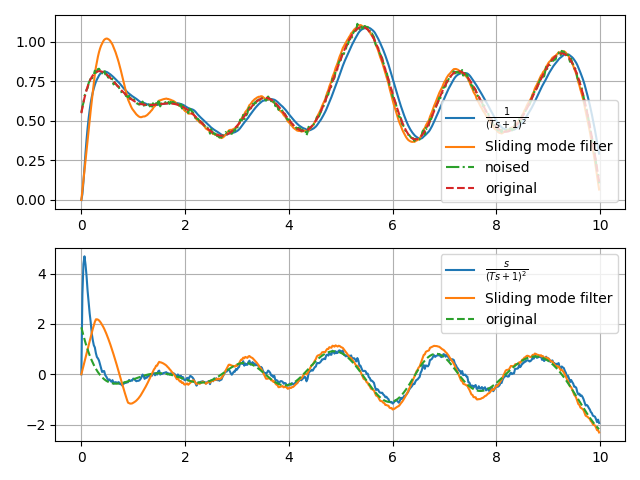

# Sliding-Mode and Super-Twist controllers comparision

Comparision of the sliding mode and super-twist controllers for the linear system $\ddot x = u$:

| | |
|:-:|:-:|
|||
|   Sliding-Mode Controller |   Super-Twist Controller      |

Comparision the derivative estimators
1. Transfer function $W(s) = \frac{s}{(Ts + 1)^2}$
2. Sliding mode 
$$
    \begin{align*}
    \dot{z}_{0} &= -\lambda_{2}L^{\frac{1}{3}}\left\lfloor z_{0}-u\right\rceil ^{\frac{2}{3}}+z_{1}  \\
    \dot{z}_{1}&=-\lambda_{1}L^{\frac{1}{2}}\left\lfloor z_{1}-\dot{z}_{0}\right\rceil ^{\frac{2}{3}}+z_{2} \\
    \dot{z}_{2}&=-\lambda_{0}L\left\lfloor z_{2}-\dot{z}_{1}\right\rceil ^{0}
    \end{align*}
$$

| |
|:-:|
||
|   Sliding-Mode Derivative Estimator |
